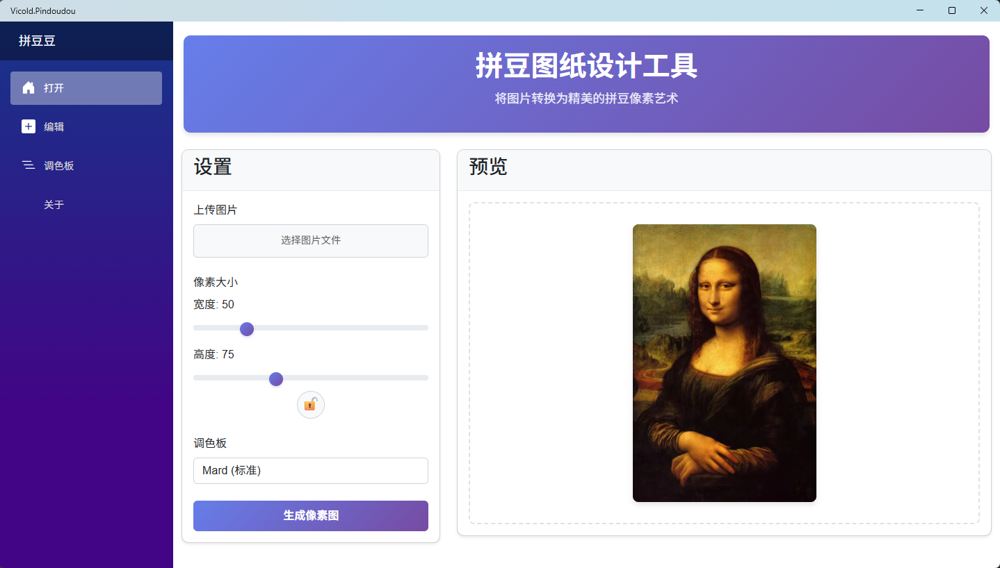
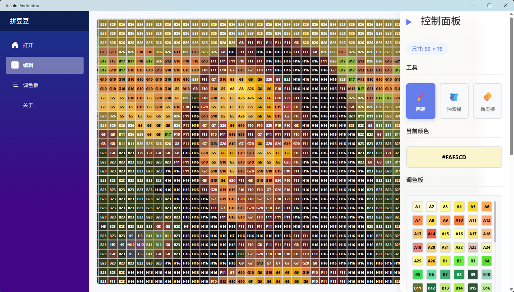

# Vicold.Pindoudou
拼豆图纸设计工具

## 版本信息

- **最新版本**：[](https://github.com/vicold/Vicold.Pindoudou/releases/latest)
- **构建版本**：1

> 构建版本会在创建新的release时自动更新

## 构建状态


## 项目简介

这是一个基于微软 Blazor Hybrid 开发的拼豆图纸设计工具，支持 Windows、Android、iOS 和 macOS 平台。工具的主要功能包括：

- 上传图片并将其转换为像素图
- 自定义像素图的宽度和高度
- 使用默认的 Mard 调色板或创建自定义调色板
- 确保生成的像素图颜色在选定的调色板中
- 编辑像素图（画笔、油漆桶、橡皮擦工具）
- 导出像素图为图片
- 保存和加载拼豆图纸资源

## 项目截图

### 主界面



### 编辑界面



## 快速开始

### 步骤 1：启动工具

运行应用程序，主页面即为拼豆图纸设计工具页面。

### 步骤 2：上传图片

点击 "上传图片" 按钮，选择一张你想要转换为拼豆图纸的图片。支持的图片格式包括 JPG、JPEG、PNG 和 GIF。

### 步骤 3：设置像素大小

使用滑块设置你想要的像素图尺寸：
- 宽度：10-200 像素
- 高度：10-200 像素

你可以点击锁定宽高比例按钮，保持宽高比例一致。

### 步骤 4：选择调色板

在 "调色板" 下拉菜单中，选择你想要使用的调色板：

- **Mard (默认)**：使用内置的 Mard 调色板
- **其他系统调色板**：根据文件系统中的调色板文件自动加载

### 步骤 5：生成像素图

点击 "生成像素图" 按钮，工具将开始处理图片并生成像素图。生成过程中，按钮会显示 "生成中..." 并禁用，生成完成后会自动跳转到编辑页面。

## 自定义调色板

### 系统调色板

工具会自动加载 `Data/Palettes` 目录中的所有 `.txt` 文件作为系统调色板。默认包含 Mard 调色板。

### 用户调色板

工具会自动加载 `Data/UserPalettes` 目录中的所有 `.txt` 文件作为用户调色板。

### 调色板格式

调色板文件为文本文件，每行包含一个颜色定义，格式为：

```
颜色代码	颜色值
```

例如：

```
A1	#FF0000
A2	#00FF00
A3	#0000FF
```

## 编辑功能

生成像素图后，工具会自动跳转到编辑页面，你可以使用以下工具编辑像素图：

### 工具选择

- **画笔**：在像素图上绘制颜色
- **油漆桶**：填充相邻的相同颜色像素
- **橡皮擦**：将像素擦除为透明

### 操作按钮

- **撤销**：撤销上一步操作（Ctrl+Z）
- **重做**：重做上一步操作（Ctrl+Y）

### 显示选项

- **显示颜色代码**：在像素上显示颜色代码
- **隐藏透明代码**：隐藏透明像素的颜色代码

## 导出和保存

### 导出为图片

点击 "导出图片" 按钮，工具会将像素图导出为图片文件。

### 保存资源

点击 "保存资源" 按钮，工具会将当前像素图保存为 JSON 格式的资源文件。

### 加载资源

点击 "导入资源" 按钮，选择一个之前保存的资源文件，工具会加载该文件并显示对应的像素图。

## 技术说明

### 颜色匹配算法

工具使用欧几里得距离算法来找到与原始图片颜色最接近的调色板颜色，确保生成的像素图颜色在选定的调色板中。

### 图片处理

工具使用 Microsoft.Maui.Graphics 库进行跨平台图片处理，包括获取图像尺寸和像素数据。

### 数据存储

- 使用 sessionStorage 存储临时导航数据和编辑状态
- 使用文件系统存储调色板文件和资源文件

### 前端技术

- 使用 Blazor WebAssembly 构建用户界面
- 使用 Bootstrap 5 进行样式设计
- 使用 JavaScript interop 实现图片导出和文件操作功能

## 常见问题

### 问题：生成的像素图与原始图片差异较大

**解答**：这是正常现象，因为像素图的颜色被限制在选定的调色板中，并且尺寸可能与原始图片不同。你可以尝试调整像素大小或使用不同的调色板来获得更好的效果。

### 问题：调色板文件不加载

**解答**：请确保调色板文件位于正确的目录：
- 系统调色板：`Data/Palettes` 目录
- 用户调色板：`Data/UserPalettes` 目录

并确保文件格式正确，每行包含一个颜色定义，格式为 `颜色代码\t颜色值`。

### 问题：编辑操作不流畅

**解答**：对于较大的像素图，编辑操作可能会有些延迟。这是正常现象，因为工具需要实时更新像素数据并保存状态。

### 问题：工具无法启动

**解答**：请确保你的设备满足应用程序的系统要求，并且已安装必要的依赖项。如果问题仍然存在，请尝试重新安装应用程序。

## 系统要求

- **Windows**：Windows 10 版本 19041.0 或更高版本
- **Android**：Android 7.0 (API 级别 24) 或更高版本
- **iOS**：iOS 14.2 或更高版本
- **macOS**：macOS 11.0 或更高版本

## 后续计划

- 实现更复杂的图片处理功能，如滤镜效果
- 支持导出像素图为多种格式（PNG、JPEG、SVG等）
- 添加更多内置调色板
- 实现像素图预览和打印功能
- 添加批量处理功能，一次转换多张图片
- 实现拼豆图纸分享功能
- 添加拼豆数量统计功能
- 实现网格线显示和隐藏功能

## 联系我们

如果您有任何问题或建议，请随时联系我们。我们将不断改进工具，为您提供更好的拼豆图纸设计体验。